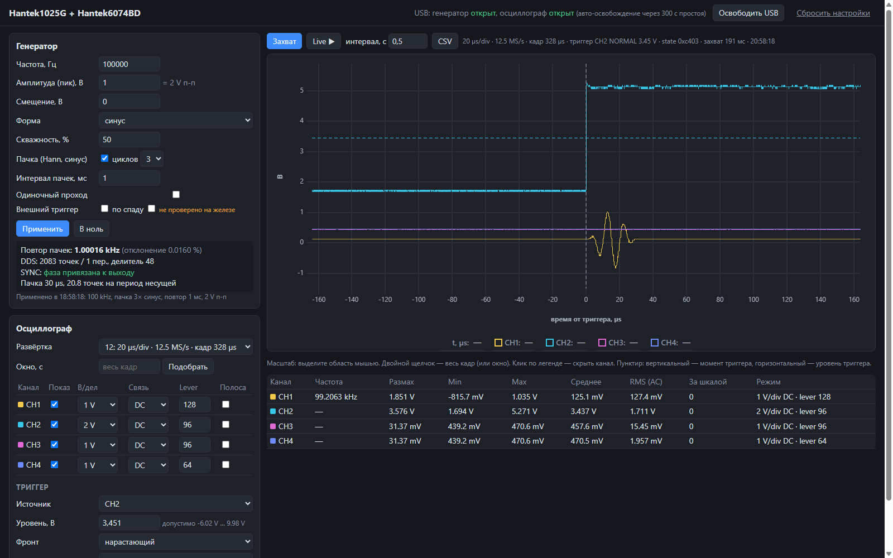

# linux_hantek1025G_6074BD

Native Linux driver, written in Python, for two USB instruments:

- **Hantek1025G** arbitrary waveform / DDS generator
- **Hantek6074BD** 4-channel oscilloscope (Hantek 6000B/6000BD family)

It talks to both devices directly over USB with PyUSB/libusb. No vendor DLLs, Wine, or kernel
modules are needed. It works as a Python library and as a command-line tool (`hantek-linux`).

> **Unofficial.** This project is not affiliated with or endorsed by Hantek. The protocol was
> reconstructed from vendor SDK behaviour, USB traces and an independent Android implementation.
> It never writes the scope's calibration or firmware (the optional recovery tools in `tools/` are
> separate and explicit). Use at your own risk.

## Status

Verified on real hardware on 2026-09-26: Raspberry Pi 4B, Debian 13 (aarch64), Python 3.13,
libusb 1.0.28, pyusb 1.3.1. The full report is in
[`evidence/verification-20260926/REPORT.md`](evidence/verification-20260926/REPORT.md).

| Area | Verified |
|---|---|
| Generator frequency | 1 Hz – 25 MHz; measured = planned DDS frequency (≤ 0.02 % error) |
| Generator waveforms | sine, square (duty cycle), triangle, sawtooth, DC offset, 2–5 cycle Hann tone bursts, single-shot mode |
| Generator amplitude | ≈ ±0.5 V → 1.0 Vpp up to 10 MHz, ≈ 0.85 Vpp at 25 MHz |
| Working range sweep | 20 kHz – 2 MHz × 0.5–4 Vpp sine: 32/32 pass; frequency exact, amplitude within ±4 %, NORMAL trigger on SYNC |
| Scope sample rates | 250 MS/s … 1.25 kS/s (time-div indices 8–24), 4096 samples × 4 channels |
| Scope ranges | 5 mV/div … 10 V/div, DC / AC / GND coupling, bandwidth-limit filter (2 mV/div: see [Limitations](#limitations)) |
| Trigger | edge, rising/falling, any channel, AUTO/NORMAL; trigger point at sample 2048 ± 2 |
| Throughput | ~33 captures/s with a fixed configuration (20 µs/div) |
| Stability | 100 consecutive captures in one session; recovery after trigger timeout |

Out of scope: time-div indices 0–7 (the vendor applies software interpolation there),
roll mode (index 25 and slower), fewer than 4 active channels, sample counts other than 4096,
and horizontal trigger positions other than 50 %.

## Hardware requirements

- **Power the scope from its external 5 V / 1 A input.** On bus power alone, the Hantek6074BD's USB
  link failed with `EPROTO`/`EIO` as soon as the front-end relays switched during initialization.
- Prefer a **powered USB 2.0 hub**. Testing used a Realtek RTS5411 (Keyron H728) hub between the Raspberry Pi and
  both devices.
- The scope must enumerate as `04b5:6cde`. If it shows up as `04b4:8613` (a bare Cypress FX2), its
  EEPROM boot marker is corrupted. See [Recovery tools](#recovery-tools).
- The generator enumerates as `0483:5726`.

```text
$ lsusb
... ID 0483:5726 STMicroelectronics Hantek1025G
... ID 04b5:6cde ROHM LSI Systems USA, LLC DSO Device
```

Example wiring used for the tests below (loopback):

```text
Hantek1025G OUTPUT   -> scope CH1
Hantek1025G SYNC OUT -> scope CH2
```

## Installation

Linux only, Python ≥ 3.10.

### 1. System packages

```sh
# Debian / Ubuntu / Raspberry Pi OS
sudo apt install python3-venv python3-pip libusb-1.0-0
```

### 2. USB permissions (udev)

Without this rule only root can open the devices.

```sh
sudo tee /etc/udev/rules.d/70-hantek-usb.rules >/dev/null <<'EOF'
# Hantek 1025G signal generator
SUBSYSTEM=="usb", ENV{DEVTYPE}=="usb_device", ATTR{idVendor}=="0483", ATTR{idProduct}=="5726", GROUP="plugdev", MODE="0660"
# Hantek 6074BD / 6000B-family oscilloscope
SUBSYSTEM=="usb", ENV{DEVTYPE}=="usb_device", ATTR{idVendor}=="04b5", ATTR{idProduct}=="6cde", GROUP="plugdev", MODE="0660"
EOF
sudo udevadm control --reload-rules && sudo udevadm trigger
sudo usermod -aG plugdev "$USER"   # then log out and back in
```

Some distributions (e.g. Fedora, Arch) have no `plugdev` group. Create one, or replace
`GROUP="plugdev", MODE="0660"` with `TAG+="uaccess"`.

### 3. Install the package

Standalone:

```sh
git clone https://github.com/Umpil/linux_hantek1025G_6074BD.git
cd linux_hantek1025G_6074BD
python3 -m venv .venv
.venv/bin/pip install .          # or: pip install -e . for development
.venv/bin/hantek-linux probe     # both devices should report "present": true
```

As a dependency of another project:

```sh
pip install "git+https://github.com/Umpil/linux_hantek1025G_6074BD.git"
```

```toml
# pyproject.toml of your project
dependencies = ["hantek-linux @ git+https://github.com/Umpil/linux_hantek1025G_6074BD.git"]
```

The only Python dependency is `pyusb` (≥ 1.3.1, < 2). pip installs it automatically.
The system `libusb-1.0` provides the native backend.

## Command-line tool

Every command prints JSON.

```sh
hantek-linux probe --calibration          # identity of both devices + scope calibration dump

# Generator: planning is a dry run unless --apply is given
hantek-linux generate --frequency 10000 --amplitude 0.5 --shape square           # plan only
hantek-linux generate --frequency 10000 --amplitude 0.5 --shape square --apply   # program it
hantek-linux generate --frequency 100000 --amplitude 0.5 --burst-cycles 3 --burst-interval-ms 1 --apply

# Scope: one 4-channel capture (defaults: AUTO sweep, trigger on CH2, 20 us/div)
hantek-linux capture
hantek-linux capture --time-div-index 17 --csv capture.csv
hantek-linux capture --trigger-sweep normal --trigger-level 3.0 --trigger-source 2

# Generator + capture in one call
hantek-linux loopback --frequency 20000 --amplitude 0.5 --shape sine --apply-generator --csv out.csv
```

Run `hantek-linux <command> --help` for all options (per-channel V/div, slope, timeout, …).
The default `--timeout 3` seconds is too short for time-div index 23 or 24; use `--timeout 10` there.
The generator keeps its output after the program exits.

## Web UI

[`webui/`](webui/README.md) is a small Flask app for exploring both instruments from a browser.
You set the generator, capture all four channels live, zoom the plot, and watch the per-channel
measurements.



```sh
.venv/bin/pip install ".[web]"
cd webui && ./run.sh        # http://<host>:5000
```

## Python API

### Generator

```python
from hantek_linux import Generator, GeneratorConfig

gen = Generator()
cfg = GeneratorConfig(frequency_hz=100_000, amplitude_v=0.5, shape="sine")  # amplitude = PEAK volts

plan = gen.apply(cfg)                  # dry run: returns the plan, no USB traffic
print(plan.frequency.actual_hz)        # exact frequency the DDS will produce

with gen.transport:                    # open/claim the USB interface
    gen.apply(cfg, dry_run=False)      # program the hardware
    ...
    gen.set_zero(dry_run=False)        # park main OUTPUT at 0 V (not high-Z, SYNC keeps running)
```

`GeneratorConfig` fields:

| Field | Default | Meaning |
|---|---|---|
| `frequency_hz` | 1000 | 1 Hz … 25 MHz (carrier frequency in tone-burst mode) |
| `amplitude_v` | 0.1 | **peak** volts; `amplitude_v + abs(offset_v)` ≤ 3.5 V |
| `offset_v` | 0.0 | DC offset |
| `shape` | `"sine"` | `sine`, `square`, `triangle`, `sawtooth` |
| `duty_cycle` | 0.5 | square wave only, 0 < d < 1 |
| `burst_cycles` | `None` | 2–5: Hann-windowed sine burst instead of a continuous wave |
| `burst_interval_s` | 0.001 | burst repetition period, 1–10 ms |
| `single` | `False` | play the waveform memory once, then hold |
| `external_trigger`, `falling` | `False` | start on the TRIG input edge (bits implemented, not validated on hardware) |

### Scope

```python
from hantek_linux import ChannelConfig, Scope, ScopeConfig

config = ScopeConfig(
    channels=(
        ChannelConfig(volts_per_div=0.5),                  # CH1
        ChannelConfig(volts_per_div=2.0),                  # CH2
        ChannelConfig(volts_per_div=1.0, coupling="ac"),   # CH3
        ChannelConfig(volts_per_div=1.0),                  # CH4
    ),
    time_div_index=12,        # 20 us/div, 12.5 MS/s (see table below)
    trigger_source=2,
    trigger_level_v=3.0,
    trigger_slope="rising",
    trigger_sweep="auto",     # "normal" waits for a real trigger (library default)
)

scope = Scope()
with scope.transport:
    capture = scope.capture(config)     # initialize (first time) + configure + arm + fetch

    ch1 = capture.waveform(1)
    print(ch1.sample_rate_hz, len(ch1.volts))   # 12.5e6, 4096
    t = [i / ch1.sample_rate_hz for i in range(len(ch1.volts))]
```

A `Capture` holds four `Waveform`s. Each has `channel`, `sample_rate_hz`, `codes` (0–255, after
vendor ADC normalization) and `volts`. `capture.signal` and `capture.sync` return the channels
named by `ScopeConfig.signal_channel` / `sync_channel` (1 and 2 by default). These are labels only;
the hardware trigger is chosen by `trigger_source`.

`ChannelConfig` fields: `volts_per_div` (0.002, 0.005, 0.01, 0.02, 0.05, 0.1, 0.2, 0.5, 1, 2, 5,
10), `coupling` (`"dc"`, `"ac"`, `"gnd"`), `bandwidth_limit`, and `lever`. `lever` is the zero
position in ADC codes, 0–255; the defaults are 192/160/96/64 for CH1–CH4. The visible range is
`(0 - lever)…(255 - lever) × 8 × V/div / 255`. For example, CH1 at 1 V/div shows −6.0 V … +2.0 V by
default. Use `lever=128` for a symmetric range.

### Repeated acquisition (fast path)

`configure()` is slow (~0.2 s: relay switching and analog settling). Call it once, then call
`capture()` without arguments:

```python
with scope.transport:
    scope.configure(config)
    for _ in range(1000):
        cap = scope.capture()          # arm + fetch only, ~30 ms at 20 us/div
```

`arm()` and `fetch()` are also available separately, for example to fire the generator between
arming and fetching.

### Reliable NORMAL triggering

Absolute DC levels are offset on real hardware (see [Limitations](#limitations)). The trigger
comparator sees the same offset, so derive the level from the signal instead of hard-coding it:

```python
from dataclasses import replace

with scope.transport:
    auto = scope.capture(replace(config, trigger_sweep="auto"))
    sync = auto.waveform(config.trigger_source).volts
    level = (min(sync) + max(sync)) / 2
    cap = scope.capture(replace(config, trigger_sweep="normal", trigger_level_v=level))
```

### Time base

`time_div_index` selects the time base. Each frame is 4096 samples (16.4 divisions), trigger at
sample 2048.

| Index | Time/div | Sample rate | Frame | | Index | Time/div | Sample rate | Frame |
|---:|---:|---:|---:|---|---:|---:|---:|---:|
| 8 | 1 µs | 250 MS/s | 16.4 µs | | 17 | 1 ms | 250 kS/s | 16.4 ms |
| 9 | 2 µs | 125 MS/s | 32.8 µs | | 18 | 2 ms | 125 kS/s | 32.8 ms |
| 10 | 5 µs | 50 MS/s | 81.9 µs | | 19 | 5 ms | 50 kS/s | 81.9 ms |
| 11 | 10 µs | 25 MS/s | 164 µs | | 20 | 10 ms | 25 kS/s | 164 ms |
| 12 | 20 µs | 12.5 MS/s | 328 µs | | 21 | 20 ms | 12.5 kS/s | 328 ms |
| 13 | 50 µs | 5 MS/s | 819 µs | | 22 | 50 ms | 5 kS/s | 819 ms |
| 14 | 100 µs | 2.5 MS/s | 1.64 ms | | 23 | 100 ms | 2.5 kS/s | 1.64 s |
| 15 | 200 µs | 1.25 MS/s | 3.28 ms | | 24 | 200 ms | 1.25 kS/s | 3.28 s |
| 16 | 500 µs | 500 kS/s | 8.19 ms | | | | | |

Indices 8, 9, 12, 15, 17, 20, 22 and 24 are verified on hardware. For slow time bases, pass a
larger `timeout_s` to `capture()`/`arm()`: the default of 2 s is shorter than the index 24 frame.

### Errors and device selection

- Every USB failure raises `hantek_linux.HantekError`, with `.operation` and `.context` attributes.
  Nothing is retried automatically. After a failed generator upload, its waveform memory may be
  partly written, and `gen.last_transfer_succeeded` is `False`.
- `Scope` remembers the USB session. After the transport is closed and reopened (for example after
  a power cycle), it initializes the scope again automatically.
- With several identical devices connected, choose one explicitly:
  `scope.transport.open(bus=1, address=5)` … `scope.transport.close()`.
- The USB identities are in `hantek_linux.GENERATOR_USB` and `hantek_linux.SCOPE_USB` (VID, PID,
  Bulk IN endpoint, packet size). `UsbTransport.for_device(SCOPE_USB)` builds a transport for one;
  pass it to `Scope(...)` or `Generator(...)`.
- The low-level scope init/sync trace is DEBUG logging on the `hantek_linux.scope` logger. Set
  `HANTEK_TRACE_SYNC=1` to print it to stderr, or enable it through your own `logging` setup.

## Limitations

- **DC offset.** The unit used for testing had these input-referred zero offsets from its factory
  calibration: CH1/CH2 about +0.16 V and CH3/CH4 about +0.44 V at 0.2–1 V/div, and 10× that at
  ≥ 2 V/div (where the 1:10 attenuator is in circuit). In the 2–100 mV/div ranges CH1 measured
  about +15 mV. Gain is accurate (≈ 0.98). Frequency, timing, Vpp and AC measurements are accurate;
  for absolute DC levels, subtract a measured baseline. On that unit the low-range offset makes
  5 mV/div usable only with a lowered `lever` (≈ 40). At 2 mV/div it fills almost the whole screen,
  so the trace clips even with `lever=0`.
- **Resolution** is 8 bits over 8 divisions (1 code = V/div / 32). Choose a range where the signal
  spans many codes.
- **SYNC OUT phase.** Up to 100 kHz, SYNC is always phase-locked to OUTPUT. Above 100 kHz it is
  locked only when `200 MHz / f` is an integer, for example 200, 250, 400, 500 or 800 kHz, or 1,
  1.25, 1.6 or 2 MHz. Check this with `plan.frequency.samples % plan.frequency.periods == 0`.
  Otherwise the SYNC edge wanders relative to OUTPUT within each memory pass: 48 ns at 1.5 MHz, and
  up to ~200 ns at 2.25 MHz. The OUTPUT frequency itself is still exact.
- **Tone bursts** repeat from waveform memory (4096 samples per burst interval). With a 1 ms
  interval the carrier can be at most ~500 kHz (4 samples per cycle; ≥ 10 samples per cycle below
  ~200 kHz). A MHz carrier is rejected rather than aliased.
- **Single mode** plays the waveform memory once. No software command re-fires it; a new upload or
  the external trigger input is needed. The external trigger has not been validated electrically.
- `set_zero()` sets the main OUTPUT to 0 V DC. It is not high-impedance, and SYNC OUT keeps toggling.
- Closing the USB connection does not stop the generator output. Reprogramming the generator can
  cause a short transient on OUTPUT.
- A sporadic USB link loss was observed once in a long test session: `EIO`, the device stays in
  `lsusb`, and even string descriptors fail. Only a physical power cycle of the scope recovers it.
- Probe attenuation is not modelled. Volts are at the BNC input (x1).

## Troubleshooting

| Symptom | Cause / fix |
|---|---|
| `select exactly one device ... 'count': 0` | Device not connected, or the scope enumerates as `04b4:8613` (see recovery). |
| `select exactly one device ... 'count': 2` | Several identical devices; use `transport.open(bus=..., address=...)`. |
| `Access denied (insufficient permissions)` | udev rule missing, or you have not logged in again since joining `plugdev`. |
| `scope acquisition timed out ... last_state 0xc200` | NORMAL trigger level outside the signal swing. Use AUTO or the midpoint recipe; raise `timeout_s` for slow time bases. |
| `[Errno 5] Input/Output Error`, `[Errno 71] Protocol error`, `The device has no langid` | USB link lost. Check external power and the hub, power-cycle the scope, then reopen. |
| `EPIPE` on request `0xEA` in the `HANTEK_TRACE_SYNC` output | Expected. This scope revision stalls it, and the driver ignores it like the vendor does. |
| First capture looks wrong after changing ranges | Should not happen any more: `configure()` waits for the analog front end to settle. |

## Recovery tools

`tools/` contains FX2 EEPROM utilities for a scope that boots as `04b4:8613`. Run them from the
repository root:

- `fx2_ram_recovery.py <image.iic> [--run]` loads the image into FX2 RAM for the current power-up
  only (the device then enumerates as `04b5:6cde`). Nothing is written to EEPROM.
- `eeprom_read_compare.py` reads the EEPROM (read-only) and compares it with the reference image.
- `eeprom_boot_marker_repair.py` refuses to act unless byte 0 is the only difference, and only
  writes that byte with `--apply`.

They need the vendor recovery image at `reference/recovery/DSO6106BD20160601.iic`
(SHA-256 `250df4f0534bd1c8ba3fa62d1bad702b295a2afdcfbcab2a3a162cd8d3a0acd2`). This repository does
not include it; obtain it from Hantek's EEPROM6000 recovery package and create that directory
yourself. Enumeration as `04b4:8613` also needs a udev rule for that VID:PID. Writing EEPROM can
brick the device, so run the read-only comparison first and apply only a single-byte repair it
agrees with.

## Development

```sh
.venv/bin/python -m unittest discover -s tests -v    # offline protocol tests, no hardware needed
cd webui && ../.venv/bin/python -m unittest discover -s tests   # web UI tests (needs ".[web]")
```

The tests only need `pyusb` installed, plus Flask for the web UI tests; they never touch USB.

```text
hantek_linux/
  transport.py   strict PyUSB transport (no retries), HantekError
  generator.py   DDS frequency planning, waveform synthesis, packet framing, upload
  scope.py       init sequence, configuration packets, trigger, acquisition, ADC decoding
  cli.py         hantek-linux command
tests/           offline golden-vector and failure-path tests
webui/           Flask browser UI (optional, pip install ".[web]")
tools/           FX2 EEPROM recovery utilities
evidence/verification-20260926/   hardware verification report, scripts and raw results
```

## License

MIT © 2026 [Umpil](https://github.com/Umpil) — see [`LICENSE`](LICENSE). You may use, modify and
redistribute this code, including commercially, as long as the copyright notice and the license
text are kept.

The vendored [uPlot](https://github.com/leeoniya/uPlot) in `webui/static/` is MIT-licensed by
Leon Sorokin ([`uPlot.LICENSE`](webui/static/uPlot.LICENSE)).

"Hantek" is a trademark of its owner and is used here only to name the supported instruments.
